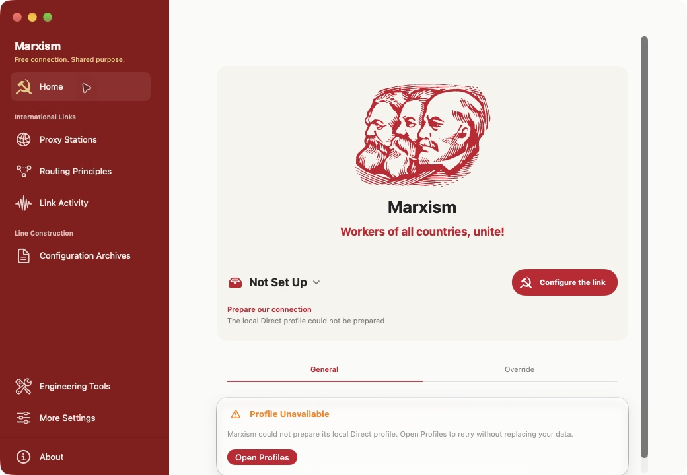
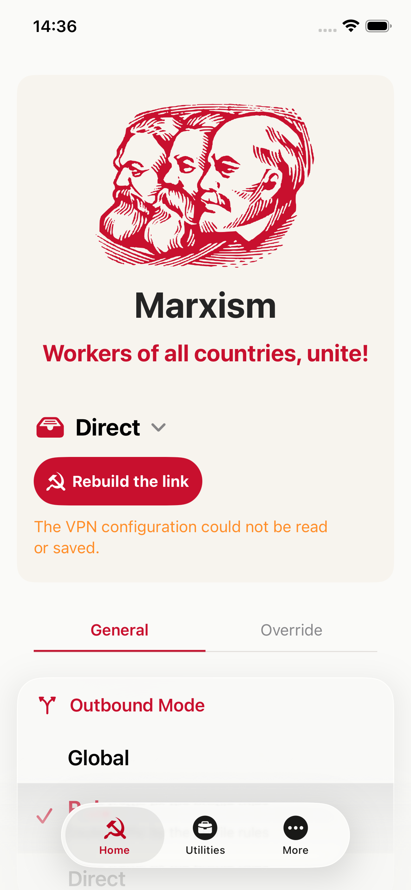
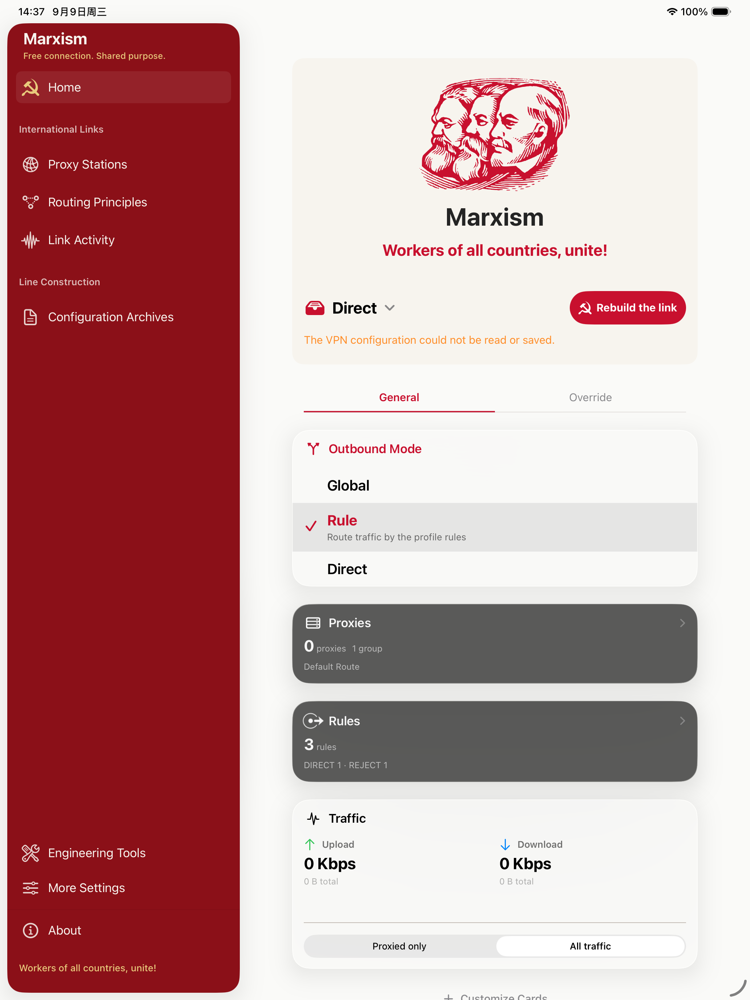
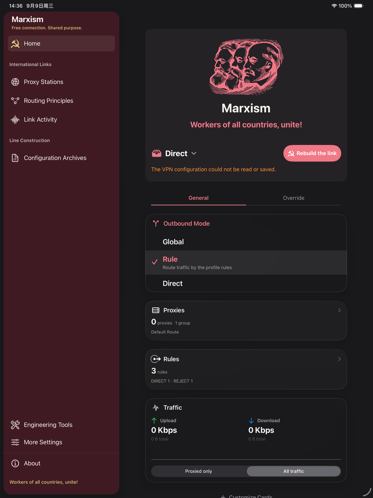
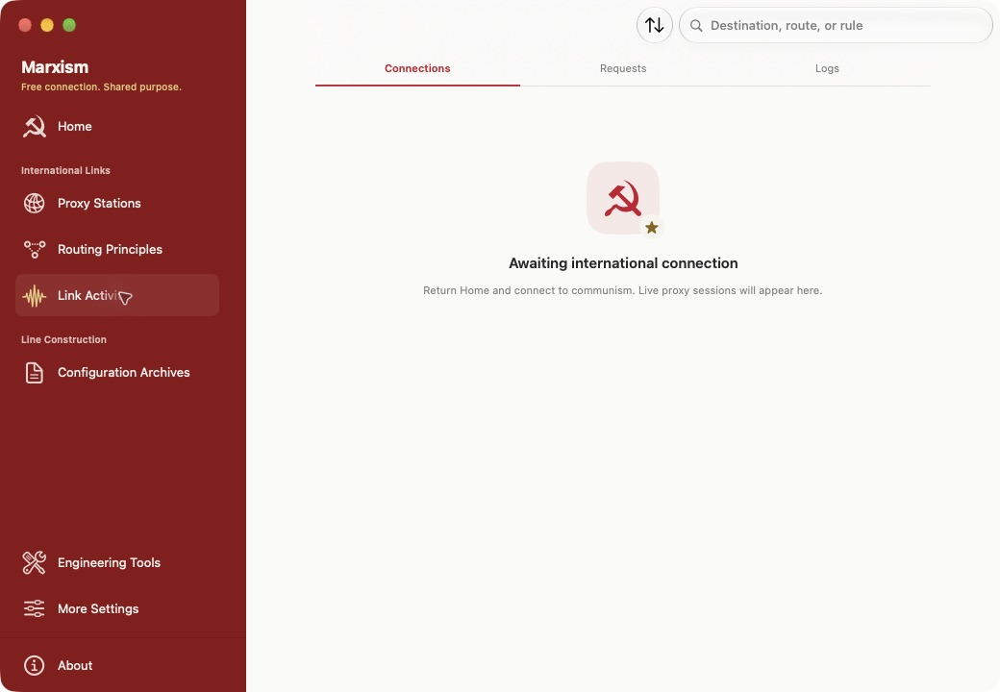
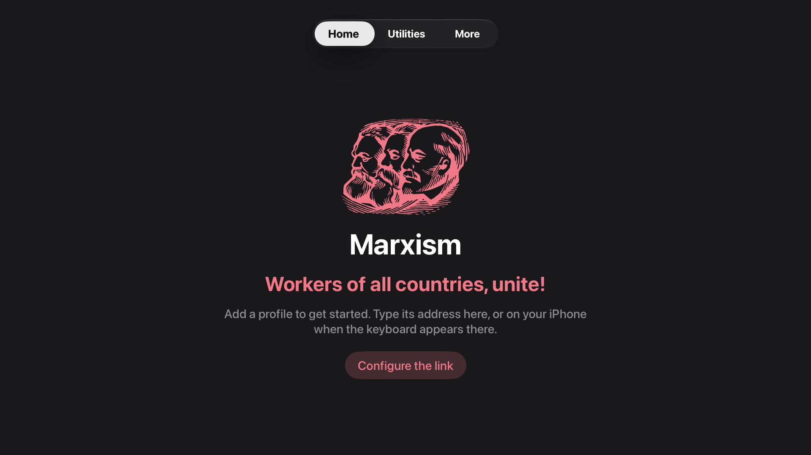

# Marxism

**Rule-based proxy utility · powered by Hako**

[中文说明 →](README.zh-CN.md)

Marxism is a just-for-fun reskin of [TokenPLS/Hako-Client](https://github.com/TokenPLS/Hako-Client)
for iPhone, iPad, Mac and Apple TV. It gives the original app a red-and-cream theme,
historical portraits and themed labels. The proxy features come from Hako-Client.

**This is an independent open-source project and is not affiliated with or endorsed by any government, political party, or organization.**

This is an entertainment project, not a political statement. The portraits, symbols
and slogans are decoration. They carry no political message and do not express or
promote a political position. This is not an official Hako-Client release.

## Original project and thanks

This project is a fork of **[TokenPLS/Hako-Client](https://github.com/TokenPLS/Hako-Client)**,
starting at commit `b05832246fcac69d13ff16df871a8d53fd394c10`.
Thank you to **TokenPLS and all Hako-Client contributors** for the original client,
and to the contributors to [Hako](https://github.com/TokenPLS/Hako) and
[Hako-Adapter](https://github.com/TokenPLS/Hako-Adapter) for the core and Apple integration.
This fork would not exist without their work.

The original code remains the work of its authors. Their copyright notices and the
[GPL-3.0 license](LICENSE) are retained. This fork does not claim ownership of the
upstream code or third-party artwork. See [credits and licenses](NOTICE.md).

## Screenshots



| iPhone 17e · iOS Simulator | iPad Pro 13-inch · iPadOS Simulator |
| --- | --- |
|  |  |

| Dark appearance · iPad | Connection state · Mac |
| --- | --- |
|  |  |

### Apple TV



[View the full 4K capture](docs/screenshots/apple-tv-4k-en.png).

These screenshots show the app running in English at normal text size.
They were taken from development builds, so some show signing or VPN setup errors. [Screenshot details and more views](docs/screenshots/README.md).
Apple TV was also checked on the tvOS 27 Simulator at 1080p and 4K.
See [verification](docs/VERIFICATION.md) for the exact scope and remaining checks.

## What changed

- Shared warm-white/charcoal surfaces, deep red navigation and native controls.
- Marx/Engels/Lenin portrait identity and standard Soviet button symbols, localized home slogan and About quotation.
- New app/extension identity: `io.github.jasmine889966.marxism`.
- A startup guard reports missing iCloud capability instead of crashing in unsigned builds.
- Core/profile/network models, dependency pins, import formats and URL schemes remain upstream-compatible.

Internal Hako module names and compatible technical identifiers are deliberately retained.

## Build from source

Requirements: macOS, a compatible full Xcode with Apple SDKs, XcodeGen, Python 3
and Go. Upstream documents Xcode 26.6 and Go 1.26.6; the local verification
uses Xcode 27 beta and Go 1.27.1. Dependencies remain pinned in `Dependencies.lock.json`.

```sh
git clone https://github.com/jasmine889966/Marxism.git
cd Marxism
git remote add upstream https://github.com/TokenPLS/Hako-Client.git
python3 -m venv .build/python-env
source .build/python-env/bin/activate
python3 -m pip install PyYAML
# Set DEVELOPER_DIR to your full Xcode if necessary.
python3 scripts/bootstrap.py
python3 scripts/configure.py
```

Bootstrap builds and verifies all five kernel SDK slices and materializes the
pinned public Adapter. Choose `HakoClient` (iOS/iPadOS), `HakoMac` or `HakoTV`.

```sh
xcodebuild -project apple/HakoClient/HakoClient.xcodeproj \
  -scheme HakoClient -configuration Debug \
  -destination 'generic/platform=iOS Simulator' CODE_SIGNING_ALLOWED=NO build
```

For the local Mac UI, use `./script/build_and_run.sh --verify`. The script respects
`DEVELOPER_DIR`, falling back to `/Applications/Xcode-beta.app/Contents/Developer`.
It builds locally without a signing identity; this is not a functional tunnel distribution.

### Your signed build

```sh
python3 scripts/configure.py --bundle-base io.github.YOUR_ACCOUNT.marxism --team YOURTEAMID
```

Enable the matching App Groups, Network Extensions, keychain and iCloud capabilities
for your own team and all extensions. Certificates and provisioning profiles are
not included. Containers are independent of the official upstream app; no private
upstream data is automatically migrated. Original import and backup workflows remain.

## Development and attribution

- [UI/function inventory](docs/UI-INVENTORY.md)
- [Design, artwork and quotation sources](docs/BRANDING.md)
- [Validation and limitations](docs/VERIFICATION.md)
- Upstream client: [TokenPLS/Hako-Client](https://github.com/TokenPLS/Hako-Client)
- Kernel: [TokenPLS/Hako](https://github.com/TokenPLS/Hako)
- Adapter: [TokenPLS/Hako-Adapter](https://github.com/TokenPLS/Hako-Adapter)

Run `python3 scripts/verify_theme.py` and the Swift package tests before submitting
changes. Report derivative UI issues here; do not represent this fork as upstream's app.
Remove credentials, subscription URLs and personal data from reports and screenshots.

## License

The source code is licensed under [GPL-3.0](LICENSE), including this fork's changes.
Original copyright notices and third-party licenses are retained.

The artwork has separate licenses:

- The Marx, Engels and Lenin portraits are by **Eugenio Hansen, OFS**, under
  **CC BY-SA 4.0**. App icons made from them use the same artwork license.
- The Soviet hammer-and-sickle artwork is available under **CC0 1.0**.

[Artwork sources and full notices](docs/BRANDING.md#artwork-and-licenses) are included
in the repository and the app. Using the artwork does not imply the artists endorse this project.
