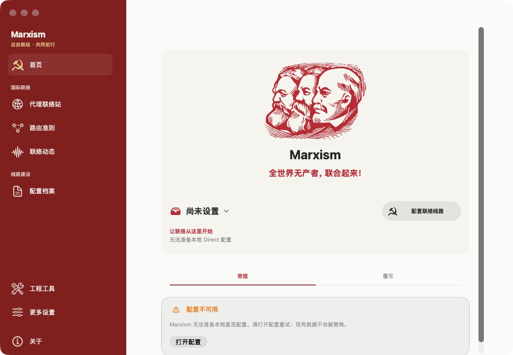
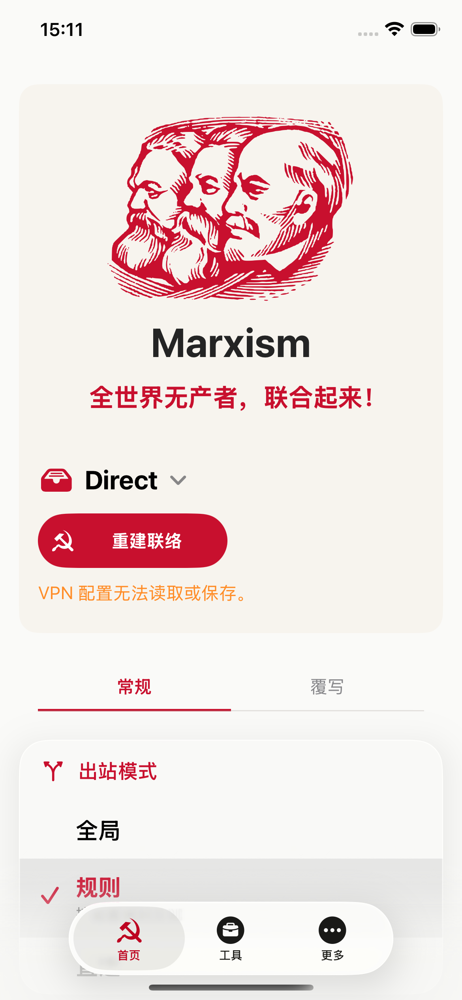
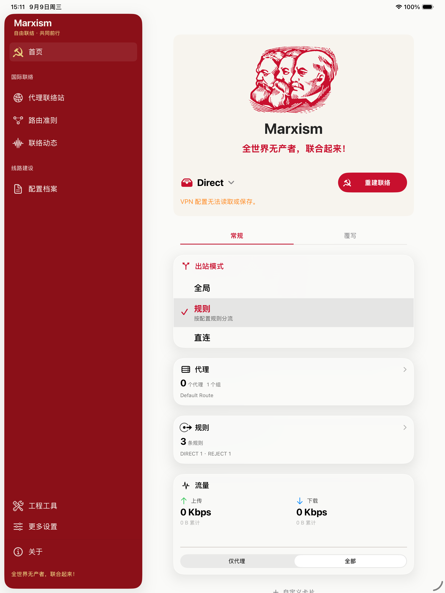
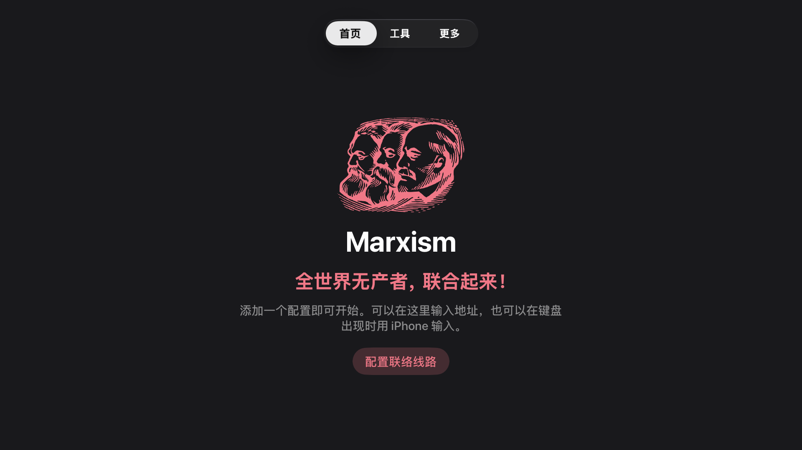

# Marxism

**规则代理工具 · 由 Hako 驱动**

[English](README.md) · 简体中文

Marxism 是基于 [TokenPLS/Hako-Client](https://github.com/TokenPLS/Hako-Client)
做的一个娱乐性换肤版本，支持 iPhone、iPad、Mac 和 Apple TV。
主要改了配色、图标和界面文案，代理功能来自原项目。

**本项目为独立开源项目，与任何政府、政党或组织均无关联，也未获得其认可或背书。**

**纯属娱乐，没有政治含义。** 界面中的肖像、符号和标语只作装饰，
不表达或宣传任何政治立场。本项目也不是 Hako-Client 官方版本。

## 原项目与致谢

本项目 fork 自 **[TokenPLS/Hako-Client](https://github.com/TokenPLS/Hako-Client)**，
起点为提交 `b05832246fcac69d13ff16df871a8d53fd394c10`。
感谢 **TokenPLS 和所有 Hako-Client 贡献者**，也感谢
[Hako](https://github.com/TokenPLS/Hako) 与
[Hako-Adapter](https://github.com/TokenPLS/Hako-Adapter) 的贡献者。
没有他们完成的客户端、内核和 Apple 平台适配，就没有这个换肤版本。

原项目代码的版权属于原作者，本仓库保留原版权声明和 [GPL-3.0 许可证](LICENSE)。
我们不把上游代码或第三方图片称作自己的原创作品。[版权与素材说明](NOTICE.md)。

## 中文界面



| iPhone 17e | iPad Pro 13 英寸 |
| --- | --- |
|  |  |



截图来自正常字号下实际运行的开发构建。部分页面显示签名或 VPN 配置错误，
具体情况见[验证记录](docs/VERIFICATION.md)。

## 换肤内容

- 统一明暗主题、深红侧栏、原生列表和紧凑卡片。
- 首页整合品牌、主标语、真实配置状态和操作；关于页保留列宁的电气化引文。
- 标语遵循现有简体中文、繁体中文和英文语言设置，无额外语言选择器。
- 各平台图标、菜单栏、扩展和小组件品牌更新。
- 独立安装标识 `io.github.jasmine889966.marxism`；原有导入格式与 URL scheme 保持兼容。
- 修复无签名构建启动时 CloudKit 容器初始化崩溃：能力缺失时返回已有不可用状态。

历史标语不是网络安全承诺。用户订阅中的名称、旗帜和配置内容保持原样。
详细出处和视觉规范见[品牌说明](docs/BRANDING.md)。

## 构建与验证

基线为上游提交 `b05832246fcac69d13ff16df871a8d53fd394c10`，内核及 Adapter
版本由 `Dependencies.lock.json` 固定。构建需要完整 Xcode、XcodeGen、Python 3、Go。
完整命令及签名步骤见[英文 README](README.md#build-from-source)。

```sh
git clone https://github.com/jasmine889966/Marxism.git
cd Marxism
python3 -m venv .build/python-env
source .build/python-env/bin/activate
python3 -m pip install PyYAML
python3 scripts/bootstrap.py
python3 scripts/configure.py
./script/build_and_run.sh --verify
```

本地 Mac 脚本默认使用 Xcode-beta，可用 `DEVELOPER_DIR` 指定自己的完整 Xcode。
无签名构建用于编译和界面检查，无法代替具备 Apple 团队签名与对应能力的隧道运行验证。
自己的 App Group、iCloud 容器和 Network Extension 必须一并配置，不自动迁移上游私有数据。

- [源码功能地图](docs/UI-INVENTORY.md)
- [验证结果与待验证范围](docs/VERIFICATION.md)
- [上游客户端](https://github.com/TokenPLS/Hako-Client)
- [Hako 内核](https://github.com/TokenPLS/Hako) · [Hako Adapter](https://github.com/TokenPLS/Hako-Adapter)

## 开源许可

保留 [GPL-3.0](LICENSE)、上游版权、第三方资源许可与致谢。品牌资源分别保留 CC BY-SA 4.0（肖像及衍生图标）与 CC0（锤镰符号），新增源码采用 GPL-3.0。这里提供源码，暂不提供签名安装包。
