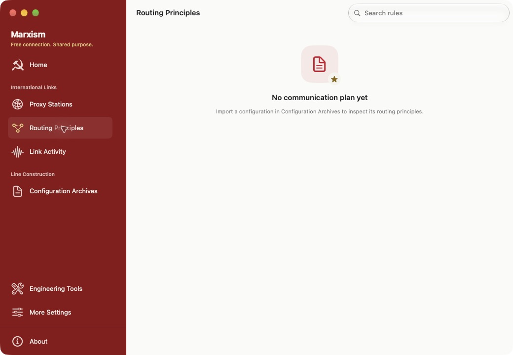
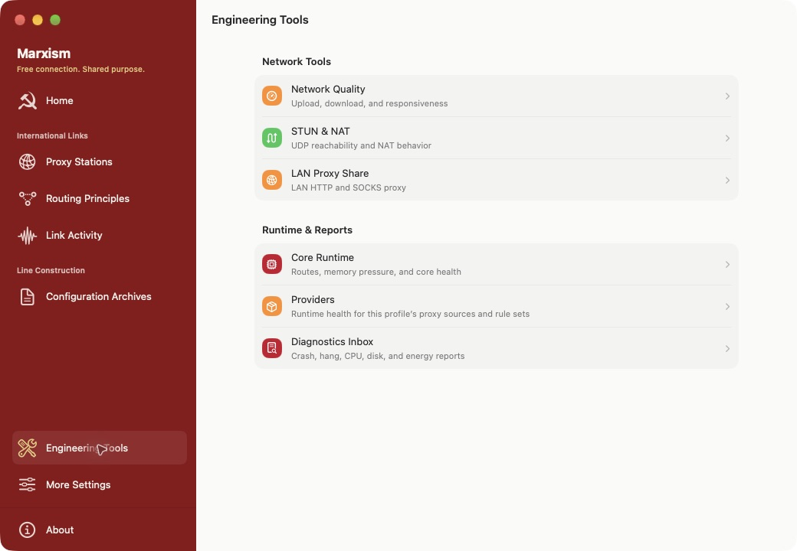
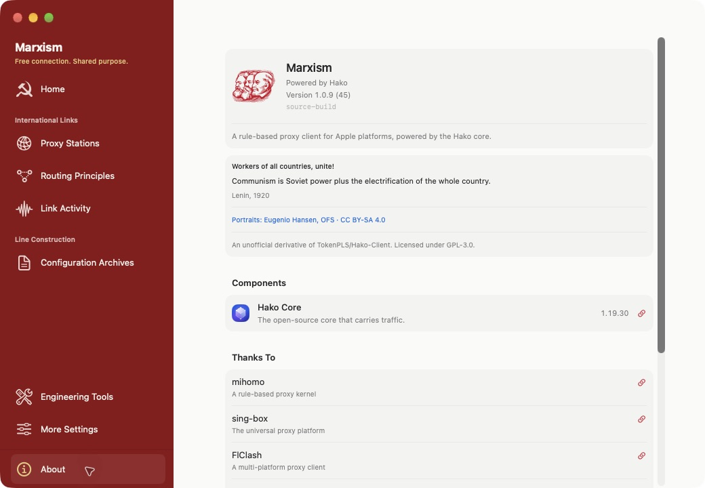

# Screenshots

Captured from running Marxism development builds on 2026-09-09. The gallery uses
English app language and standard text size. Images are not mockups or composites.
The simulator system status bar may follow the host's locale.

| Capture | Environment | Resolution |
| --- | --- | --- |
| [Mac home](macos-home-en.png) | macOS, unsigned Debug | 1040 × 720 |
| [iPhone home](iphone-17e-home-en.png) | iPhone 17e, iOS 26.5 Simulator | 1170 × 2532 |
| [iPad home](ipad-pro-13-home-en.png) | iPad Pro 13-inch (M5), iOS 26.5 Simulator | 2064 × 2752 |
| [Apple TV 1080p](apple-tv-1080p-en.png) | Apple TV 4K (3rd generation), tvOS 27.0 Simulator | 1920 × 1080 |
| [Apple TV 4K](apple-tv-4k-en.png) | Apple TV 4K (3rd generation), tvOS 27.0 Simulator | 3840 × 2160 |
| [iPad dark appearance](ipad-pro-13-home-dark-en.png) | Same iPad simulator, dark appearance | 2064 × 2752 |

The home captures show actual development-build limitations: macOS cannot prepare
its shared-container profile, and the simulator cannot save the system VPN
configuration. They do not claim an active tunnel. No private subscription data is
present. Apple TV captures show the actual first-run welcome page without a profile.
No fixture, connected-state override or private subscription was used.

## Routing principles

## Link activity

## Engineering tools

## Historical identity and attribution

